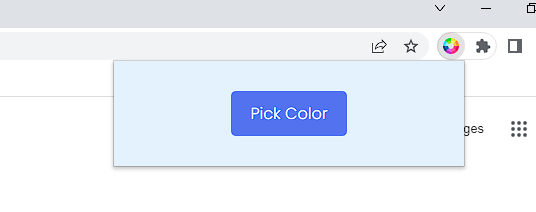
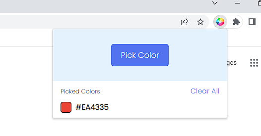

# ColorPicker_ExtensionChrome
🎨🖌️🔎A simple color picker extension. Easily pick any color on the screen, view a history of picked colors, and copy or clear them with a single click.

## Picture :

### How does the extension work? 
  

  
### After clicking on the "Choose color" button, a loop appears.  
  

  
### Choose the color you want  
  

  
### Code hex appears on pop up   

### You can copy the code by clicking on the color

### by @ranki
